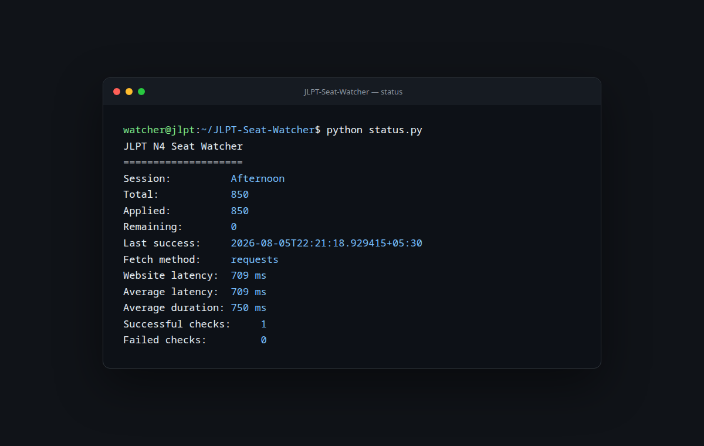

# Watchtower Website Monitor

[](https://github.com/Jxck007/JLPT-Seat-Watcher/actions/workflows/ci.yml)
[](https://github.com/Jxck007/JLPT-Seat-Watcher/actions/workflows/monitor.yml)
[](https://jxck007.github.io/JLPT-Seat-Watcher/)

Watchtower is an adapter-driven website monitor. Its default `jlpt_chennai`
adapter monitors the public examination table at
[jlptchennaiindia.com](https://www.jlptchennaiindia.com/) and sends an immediate
notification through ntfy, Telegram, Discord, Slack, or SMTP email when seats
become available for any configured level. It does not log in, submit forms, or
interact with registration.

The core engine owns scheduling, state, history, alert cadence, and provider
delivery. Website-specific behavior lives behind four adapter operations:
`fetch()`, `parse()`, `validate()`, and `notify()`. The JLPT adapter uses
lightweight static requests normally and launches Chromium only when needed.

## Status dashboard

The responsive public dashboard is hosted from [`docs/`](docs/) with GitHub
Pages: **[Open the JLPT Seat Watcher dashboard](https://jxck007.github.io/JLPT-Seat-Watcher/)**.

It uses HTML, CSS, vanilla JavaScript, and Chart.js. Every monitor execution
publishes [`docs/status.json`](docs/status.json),
[`docs/history.json`](docs/history.json), [`docs/metrics.json`](docs/metrics.json),
and [`docs/health.json`](docs/health.json). The browser refreshes all four files
every 60 seconds without authentication or GitHub API calls. Public history is
capped at the latest 500 checks and is also available as
[`docs/history.csv`](docs/history.csv). The dashboard never reads notification
topics, tokens, or other private runtime configuration.

To enable GitHub Pages, select **GitHub Actions** as the source under **Settings
→ Pages**.



## What it does

- Runs a domain-neutral monitoring engine through a selected website adapter.
- Watches any combination of N5, N4, N3, N2, and N1 from `config.yaml`.
- Selects sessions dynamically with Auto, Forenoon, Afternoon, or Both mode.
- Fetches the website once per cycle and validates every configured level.
- Validates that counters are unique within each selected session, non-negative, and
  satisfy `Total = Applied + Remaining`.
- Retries transient failures with rotating user agents and exponential backoff.
- Falls back automatically to Playwright and captures diagnostic HTML/screenshots.
- Sends hourly silent heartbeats, urgent ten-minute repeats while seats remain,
  and a daily operational summary.
- Stores state atomically so restarts do not reset alert cadence.
- Runs as a local daemon, one-shot cron task, container, cloud worker, or GitHub
  Actions schedule.

## Quick start

Python 3.12 or newer and credentials for one notification provider are required.
ntfy remains the default.

```bash
git clone https://github.com/Jxck007/JLPT-Seat-Watcher.git
cd JLPT-Seat-Watcher
python3.12 -m venv .venv
source .venv/bin/activate
python -m pip install -r requirements.txt
playwright install --with-deps chromium
cp .env.example .env
```

Set a hard-to-guess topic in `.env`:

```dotenv
NTFY_TOPIC=my-private-random-topic-name
```

Select the provider in `config.yaml`:

```yaml
adapter: jlpt_chennai
notification_provider: ntfy
```

`jlpt_chennai` remains the default when `adapter` is omitted.

Select one or more levels in `config.yaml`:

```yaml
watched_levels:
  - N4
  - N2
session: Auto
```

Session modes:

| Mode | Behavior |
|---|---|
| `Auto` | Detect the single session containing each selected level |
| `Forenoon` | Monitor selected levels only in the Forenoon section |
| `Afternoon` | Monitor selected levels only in the Afternoon section |
| `Both` | Monitor every selected level/session match in both sections |

`Both` treats the same level in Forenoon and Afternoon as two independent
targets with separate state and alert cadence.

Subscribe to that topic in the ntfy mobile app or web client, then test it:

```bash
python notify_test.py
python monitor.py
python status.py
python main.py
```

`main.py` runs continuously. `monitor.py` performs exactly one cycle and is the
right entrypoint for cron and GitHub Actions.

## Alert behavior

| Situation | ntfy priority | Behavior |
|---|---:|---|
| First successful run / hourly | 1 (silent) | One heartbeat containing every watched target |
| Remaining becomes positive | 4 (high) | Immediate per-level/session availability alert |
| Positive count changes | 4 (high) | Immediate updated alert for that target |
| Seats remain positive | 4 (high) | Per-target repeat no more than every 10 minutes |
| Daily after 20:00 local time | 3 (normal) | Checks, range, and latency summary |
| Remaining returns to zero | — | Urgent repeats stop automatically |

Notification timestamps are committed to `data/state.json` only after ntfy
accepts the message. A failed send therefore remains eligible on the next run.

## Configuration

Public, non-secret settings live in [`config.yaml`](config.yaml). Existing
environment variables remain supported and take precedence over matching YAML
keys, so current deployments continue to work unchanged.

| YAML key | Default | Purpose |
|---|---|---|
| `adapter` | `jlpt_chennai` | Website adapter registered with Watchtower |
| `watched_levels` | `[N4]` | Unique list containing any of N5, N4, N3, N2, and N1 |
| `session` | `Auto` | `Auto`, `Forenoon`, `Afternoon`, or `Both` |
| `notification_provider` | `ntfy` | `ntfy`, `telegram`, `discord`, `slack`, or `email` |
| `website_url` | JLPT Chennai website | Public counter source |
| `timezone` | `Asia/Kolkata` | IANA timezone for timestamps and summaries |
| `check_interval` | `300` | Continuous-mode seconds between cycles |
| `heartbeat_interval` | `3600` | Seconds between silent heartbeats |
| `urgent_interval` | `600` | Per-target repeat interval while seats remain |
| `log_level` | `INFO` | Console and JSON log threshold |
| `scraper_timeout` | `30` | HTTP/browser timeout in seconds |
| `max_retries` | `3` | HTTP and ntfy delivery attempts |
| `enable_screenshot` | `true` | Capture browser failure screenshots |
| `enable_playwright` | `true` | Permit rendered fallback |
| `enable_daily_summary` | `true` | Enable normal-priority daily report |
| `daily_summary_hour` | `20` | First local hour eligible for the report |
| `log_retention_days` | `30` | Runtime artifact retention |
| `history_retention_days` | `30` | Execution history retention and pruning window |
| `ntfy_server` | `https://ntfy.sh` | Server for topic slugs |
| `smtp_host` | empty | SMTP server hostname |
| `smtp_port` | `587` | SMTP server port |
| `smtp_from` | empty | Sender email address |
| `smtp_to` | `[]` | Recipient email address list |
| `smtp_use_tls` | `true` | Enable STARTTLS |
| `smtp_use_ssl` | `false` | Enable implicit TLS instead of STARTTLS |

Provider credentials remain environment variables and are never read from the
committed YAML file:

| Provider | Required environment variables |
|---|---|
| ntfy | `NTFY_TOPIC`; optional `NTFY_TOKEN` |
| Telegram | `TELEGRAM_BOT_TOKEN`, `TELEGRAM_CHAT_ID` |
| Discord | `DISCORD_WEBHOOK_URL` |
| Slack | `SLACK_WEBHOOK_URL` |
| Email | optional `SMTP_USERNAME`, `SMTP_PASSWORD`; `SMTP_TO` can override YAML recipients |

`NOTIFICATION_PROVIDER` can override the YAML selection. Provider errors never
include credentials, topic names, tokens, or webhook URLs. Never commit `.env`;
it is ignored by Git.

## Operator commands

```bash
python -m watchtower check
python -m watchtower daemon
python -m watchtower status
python -m watchtower stats
python -m watchtower health
python -m watchtower scraper-test
python -m watchtower parser-test [saved-page.html]
python -m watchtower notify-test --priority emergency
python -m watchtower export-state --output state-export.json
python -m watchtower export-history --output-dir data
python -m watchtower export-dashboard --output-dir docs
python -m watchtower cleanup
```

The legacy `python -m jlpt_seat_watcher ...` commands and
`jlpt-seat-watcher` console script remain fully supported.

The health command returns a nonzero status when state is absent/corrupt or the
last successful check is older than the greater of 15 minutes and three check
intervals.

## GitHub Actions

Add the selected provider's environment variables under **Settings → Secrets
and variables → Actions**. The existing `NTFY_TOPIC` setup continues to work
unchanged because ntfy is the default. Add `NTFY_TOKEN` only for a protected
ntfy server.

The monitor workflow runs every five minutes and serializes executions. Updated
state is stored in immutable, run-specific caches restored through a common
prefix. After every run, the standalone dashboard publisher creates the four
secret-free JSON contracts, caps public history at 500 checks, commits the
files, and pushes them to `main`. Manual dispatch can independently run a live
scraper test or a labelled notification test. Every execution writes a summary;
failed runs upload logs, HTML, screenshots, and state for 14 days.

Additional manual diagnostics and exports are available from **Actions → Manual
Operations → Run workflow**. Select one or more operations in a single run:

- **Test Notification** sends a test through the configured provider.
- **Test Scraper** performs a live browser connectivity check.
- **Test Parser** parses the bundled HTML fixture without contacting the site.
- **Print Current Seats** displays the latest cached monitoring state.
- **Health Check** validates configuration and cached-state freshness.
- **Export Logs** packages the latest monitoring run logs as an artifact.
- **Export State** packages the latest cached state as a JSON artifact.

Every selected operation writes its result to the GitHub Actions summary. Log
and state exports are retained for 14 days. This workflow is separate from the
scheduled monitor and does not alter its schedule or behavior.

The separate **Publish Dashboard** workflow runs after each monitor workflow and
deploys the committed `docs/` directory to GitHub Pages. It receives no monitor
credentials and does not regenerate runtime data. The public URL therefore
shows the exact committed snapshot from the triggering monitor run.

GitHub schedules are best-effort and may start late during busy periods. A VM,
cron, or continuously running container is preferable when ten-minute urgent
repeat timing must be precise.

## Quality checks

```bash
python -m pip install -r requirements-dev.txt
black --check .
isort --check-only .
ruff check .
mypy src
pytest
docker build -t jlpt-seat-watcher .
```

Unit tests never depend on the live website. The manual `scraper-test` command
is the explicit live integration check.

## Documentation

- [Architecture and data flow](docs/architecture.md)
- [Adapter development](docs/adapters.md)
- [Deployment guide](docs/deployment.md)
- [Troubleshooting and FAQ](docs/troubleshooting.md)
- [Notification examples](docs/notifications.md)

## Responsible operation

The five-minute default produces at most one lightweight request per run. Do not
lower the interval below the validated 30-second minimum. The project is an
availability notifier, not an automated registration client; always complete
registration manually on the official website.

## License

[MIT](LICENSE)
