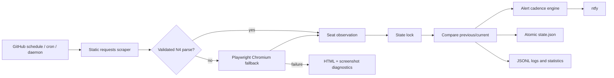

# Architecture

## Data flow

## Components

The scraper performs bounded HTTP attempts with a different user agent per
attempt. A successful response is parsed before any browser is started. The
primary parser walks the site's session headers and counter cells; a bounded
semantic parser can recover data after a CSS/class change while marking the
observation as structurally changed.

The parser accepts only one N4 row in the Afternoon section. It rejects missing,
ambiguous, malformed, negative, or arithmetically inconsistent counters. A bad
parse never becomes an availability notification.

The monitor acquires a file lock after scraping, reloads the newest state, and
keeps that lock through notification decisions and atomic persistence. This
prevents overlapping cron processes from independently sending the same alert.
Atomic replacement ensures readers see either the old complete document or the
new complete document.

## State schema

`data/state.json` contains a schema version, previous/current observations,
successful notification timestamps, and operational statistics. Observation
timestamps include their UTC offset. Statistics include total checks, successes,
failures, consecutive failures, last success/failure, cumulative duration and
latency, and a local-day bucket used by the summary.

If JSON or its schema is invalid, normal monitor operation moves it to a unique
`state.corrupt-*.json` diagnostic file and begins with a clean schema. Read-only
status and health commands do not recover silently; they return an error so an
operator can investigate.

## Delivery semantics

Notification delivery is at least once. A notification timestamp is saved only
after ntfy returns success. A process terminated after delivery but before the
state replacement can send the same notification again; accepting this narrow
duplicate window avoids the more dangerous possibility of permanently losing an
availability alert.

## Failure handling

- Retryable HTTP/network errors use exponential backoff with jitter.
- A failed or unsafe static parse invokes Playwright when enabled.
- Received HTML is preserved when static parsing fails.
- Rendered HTML and a full-page screenshot are preserved when browser parsing
  fails and screenshots are enabled.
- The continuous daemon logs an unsuccessful cycle and continues after the
  configured interval.
- Each failed cycle updates durable failure counters without replacing the last
  successful observation.

