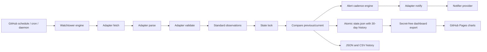

# Architecture

## Data flow

## Core and adapter boundary

`watchtower.monitor.MonitorEngine` is domain-neutral. It calls the selected
adapter in a fixed sequence: `fetch()`, `parse()`, then `validate()`. Validated
objects implement the standard `MonitorObservation` protocol, which supplies a
stable target key, current value, availability state, comparison values,
timestamp, latency, and serialization methods.

The engine then handles locking, change comparison, alert cadence, failure
counters, state persistence, history pruning, and daily statistics. When an
alert is due, it sends a `NotificationEvent` to the adapter's `notify()` method.
The adapter owns domain wording and tags while the configured `Notifier` owns
transport delivery.

Adapter modules self-register by name and are discovered automatically. A new
built-in website integration therefore requires one class implementing only
`fetch()`, `parse()`, `validate()`, and `notify()`. See
[Adapter development](adapters.md).

## Default JLPT Chennai adapter

`watchtower.adapters.jlpt_chennai` contains the original parser, scraper, and
notification formatting. It remains selected by default. The adapter preserves
static HTTP retries, parser validation, the automatic Playwright fallback,
diagnostic captures, multi-level/session monitoring, and the existing JLPT
notification payload.

## Components

The JLPT scraper performs bounded HTTP attempts with a different user agent per
attempt. A successful response is parsed before any browser is started. The
primary parser walks the site's session headers and counter cells; a bounded
semantic parser can recover data after a CSS/class change while marking the
observation as structurally changed.

The parser accepts configured combinations of N5, N4, N3, N2, and N1 without a
fixed level-to-session map. Auto mode finds the single session containing each
level. Forenoon and Afternoon filter to one named section. Both returns a unique
observation for every matching level/session pair. Malformed, negative,
ambiguous, duplicate, or arithmetically inconsistent counters fail the complete
cycle and never become availability notifications.

The core engine acquires a file lock after validation, reloads the newest state,
and keeps that lock through notification decisions and atomic persistence. This
prevents overlapping cron processes from independently sending the same alert.
Atomic replacement ensures readers see either the old complete document or the
new complete document.

Notification delivery depends only on the abstract `Notifier` contract. Each
provider self-registers by name, so monitor and CLI code do not contain provider
branches. ntfy, Telegram, Discord, Slack webhooks, and SMTP email implement the
same configured/send interface. Adding another provider requires one additional
subclass.

## State schema

`data/state.json` contains a schema version, per-target state,
independent urgent notification timestamps, shared heartbeat and summary
timestamps, and operational statistics. The legacy per-level and top-level
fields mirror the first matching target for backward compatibility. Existing
schema-v1 N4 and per-level state migrate in place on the next successful run.

Each successful cycle appends one execution record containing its timestamp,
complete duration, maximum website latency, successful notification count, and
all observed values. Records older than the configured 30-day window are
removed before state is saved. Daily statistics are rebuilt from retained
executions, including execution and notification totals, average duration and
latency, and per-target seat ranges.

`data/history.json` and `data/history.csv` are atomic runtime exports. JSON keeps
the execution envelopes and daily statistics. CSV flattens each observation
into a spreadsheet-friendly row while retaining the legacy JLPT seat columns.
Cached state remains the durable source, so both formats can be regenerated on
a fresh runner.

After each monitor run, `scripts/publish_dashboard.py` reads existing state and
emits `docs/status.json`, `docs/history.json`, `docs/metrics.json`, and
`docs/health.json`. It merges committed public history, retains the latest 500
checks, and writes the files atomically. The monitor workflow commits these safe
outputs to `main`; the separate Pages workflow only deploys `docs/`. Provider
credentials and private runtime configuration never enter the Pages artifact.

If JSON or its schema is invalid, normal monitor operation moves it to a unique
`state.corrupt-*.json` diagnostic file and begins with a clean schema. Read-only
status and health commands do not recover silently; they return an error so an
operator can investigate.

## Delivery semantics

Notification delivery is at least once. A notification timestamp is saved only
after the configured provider returns success. A process terminated after
delivery but before the state replacement can send the same notification again;
accepting this narrow duplicate window avoids the more dangerous possibility of
permanently losing an availability alert.

## Failure handling

- Retryable HTTP/network errors use exponential backoff with jitter.
- A failed or unsafe static parse invokes Playwright when enabled.
- Received HTML is preserved when static parsing fails.
- Rendered HTML and a full-page screenshot are preserved when browser parsing
  fails and screenshots are enabled.
- The continuous daemon logs an unsuccessful cycle and continues after the
  configured interval.
- Each failed cycle updates durable failure counters without replacing the last
  successful observation.
